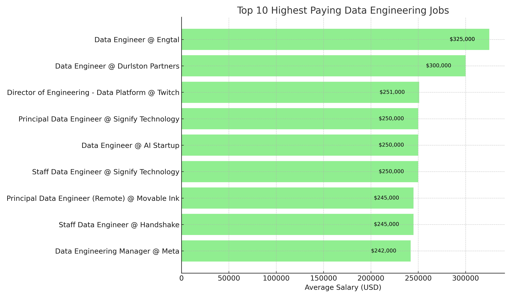
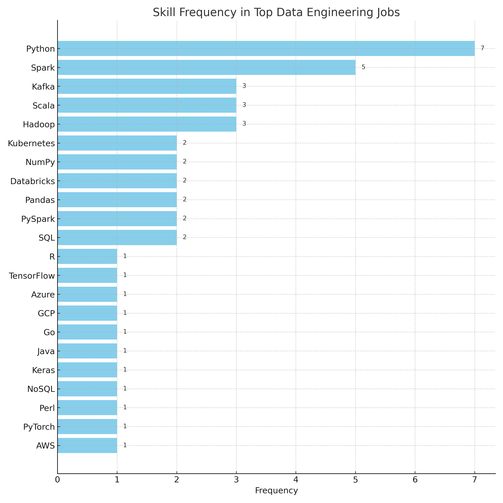
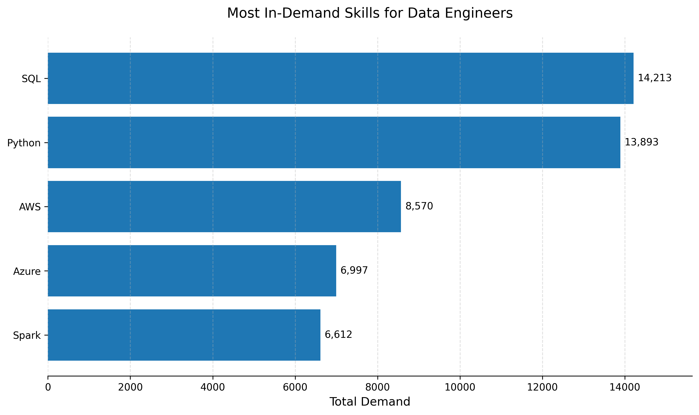
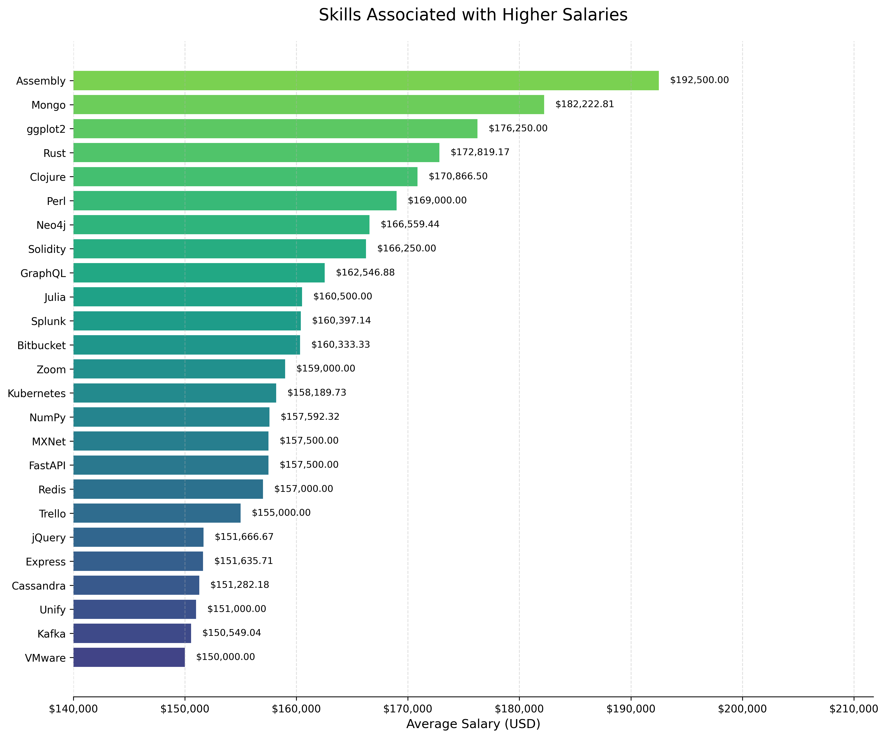
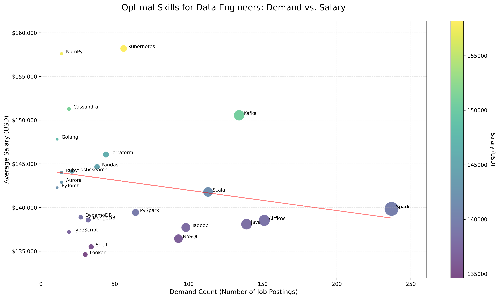

# SQL_Project_Job_Data_Analysis
A project that leverages data of different job types in the tech data spaces and tries to gain insight about what are the top paying jobs for the role of Data Engineer.

## Introduction
This project analyzes job market data to understand salary trends, required skills, and job opportunities for Data Engineers. Using SQL queries and data analysis techniques, we explore a comprehensive dataset of job postings to derive meaningful insights about the data engineering field.

🔍SQL queries? Check them out here: [project_sql folder](project_sql/)

## Background
The tech industry, particularly the data space, is rapidly evolving with varying compensation packages and skill requirements. Understanding these trends is crucial for:
- Career planning in data engineering
- Identifying valuable skills to acquire
- Understanding market demands
- Making informed career decisions

Data hails from my [SQL Course](https://lukebarousse.com/sql).  It's packed with insights on job titles, salaries, locations and essential skills.

### The questions I wanted to answer through my SQL queries were:

1. What are the top-paying data Engineer jobs?
2. what skills are required for these top-paying jobs?
3. What skills are most in demand for data Engineer?
4. which skills are associated with higher salaries?
5. What are the most optimal skills to learn?
6. What Jobs are in my Local area that are available?

## Tools I Used
For my deep dive into the data engineer job market, I used the power of several key tools:

- **PostgreSQL:** THe main (Primary database) management system,
ideal for handling the job osting data.
- **SQL:** The backbone of my analysis, permitting me to 
query the database and find critical insights and analysis.
- **Git and Github:** Important version control handler and ensures that my workflow
is in order. Powerful tool for sharing my SQL scripts and analysis, ensuring
collaboration and project management.
- **Visual Studio Code:** My main go-to for database management
and executing SQL queries.


## The Analysis
The project focuses on several key areas of the data engineer job market.
Here's how I approached each  question:

### 1. Top Paying Data Engineer Jobs
To identify the highest-paying roles, I filtered
data engineer positions by average yearly salary and location, focusing on remote
jobs. This query highlights the high paying opportunities in the field.

```sql
SELECT
    job_id,
    job_title,
    job_location,
    job_schedule_type,
    salary_year_avg,
    job_posted_date,
    name AS company_name
FROM
    job_postings_fact
LEFT JOIN company_dim ON job_postings_fact.company_id = company_dim.company_id
WHERE 
    (job_title_short = 'Data Engineer' AND 
    job_location = 'Anywhere') AND
    salary_year_avg IS NOT NULL
ORDER BY  salary_year_avg DESC
LIMIT 10;
``` 
### Top Paying Jobs in Data Engineering

Based on the analysis of job postings, here are the top-paying Data Engineering roles:

| Rank | Job Title                              | Company             | Location   | Average Salary (USD) |
|------|----------------------------------------|---------------------|------------|----------------------|
| 1    | Data Engineer                          | Engtal              | Anywhere   | $325,000             |
| 2    | Data Engineer                          | Engtal              | Anywhere   | $325,000             |
| 3    | Data Engineer                          | Durlston Partners   | Anywhere   | $300,000             |
| 4    | Director of Engineering - Data Platform| Twitch              | Anywhere   | $251,000             |
| 5    | Principal Data Engineer                | Signify Technology  | Anywhere   | $250,000             |
| 6    | Data Engineer                          | AI Startup          | Anywhere   | $250,000             |
| 7    | Staff Data Engineer                    | Signify Technology  | Anywhere   | $250,000             |
| 8    | Principal Data Engineer (Remote)       | Movable Ink         | Anywhere   | $245,000             |
| 9    | Staff Data Engineer                    | Handshake           | Anywhere   | $245,000             |
| 10   | Data Engineering Manager               | Meta                | Anywhere   | $242,000             |
#### Salary Range Overview



*Note: The above graphs are generated from the analyzed dataset. For interactive charts and more details, see the `assets` folder.*

Certainly! Here’s an explanation of your **first table analysis** ("Top Paying Jobs in Data Engineering"):

---

### Top Paying Jobs in Data Engineering — Table Analysis

This table presents the **top 10 highest-paying Data Engineering roles** based on your dataset. The analysis was performed by filtering job postings for the "Data Engineer" role, focusing on remote positions (location: "Anywhere"), and sorting them by the highest average yearly salary.

**How the table was generated:**
- The SQL query selects jobs where `job_title_short = 'Data Engineer'` and `job_location = 'Anywhere'`.
- It joins with the company table to get the company name.
- Results are ordered by `salary_year_avg` in descending order, and only the top 10 are shown.

**What the table shows:**
- **Rank:** Position in the top 10 by salary.
- **Job Title:** The specific title for the role.
- **Company:** The employer offering the job.
- **Location:** All jobs are remote ("Anywhere").
- **Average Salary (USD):** The average annual salary for the position.

**Key Insights:**
- The highest salaries for Data Engineers can reach up to $325,000 per year.
- Multiple companies (e.g., Engtal, Signify Technology) appear more than once, indicating they offer several high-paying roles.
- Senior and specialized roles (e.g., "Director of Engineering - Data Platform", "Principal Data Engineer") are among the top earners.
- All roles listed are remote, reflecting the strong demand and flexibility for top data engineering talent.

**Why this matters:**  
This table helps job seekers and professionals understand which companies and roles offer the highest compensation in the data engineering field, and highlights the value of remote work in accessing top-paying opportunities.

---

### 2. Skills Required for Top-Paying Data Engineer Jobs

To uncover the most sought-after skills among the highest-paying data engineering roles, I joined job postings with their associated skills and filtered for top salary positions.

```sql
WITH top_paying_jobs AS (
SELECT
    job_id,
    job_title,
    job_location,
    job_schedule_type,
    salary_year_avg,
    job_posted_date,
    name AS company_name
FROM
    job_postings_fact
LEFT JOIN company_dim ON job_postings_fact.company_id = company_dim.company_id
WHERE 
    (job_title_short = 'Data Engineer' AND 
    job_location = 'Anywhere') AND
    salary_year_avg IS NOT NULL
ORDER BY  salary_year_avg DESC
LIMIT 10
)
SELECT 
    top_paying_jobs.*,
    skills_dim.skills
FROM top_paying_jobs
INNER JOIN skills_job_dim ON top_paying_jobs.job_id = skills_job_dim.job_id 
INNER JOIN  skills_dim ON skills_job_dim.skill_id = skills_dim.skill_id
ORDER BY
    salary_year_avg DESC;
```

### Top Skills for High-Paying Data Engineer Jobs

Based on analysis of the top 10 highest-paying Data Engineer positions, the most frequently required skills are:

| Rank | Skill          | Frequency |
|------|----------------|-----------|
| 1    | Python         | 7         |
| 2    | Spark          | 5         |
| 3    | Kafka          | 3         |
| 4    | Scala          | 3         |
| 5    | Hadoop         | 3         |
| 6    | NumPy          | 2         |
| 7    | Databricks     | 2         |
| 8    | Pandas         | 2         |
| 9    | PySpark        | 2         |
| 10   | Kubernetes     | 2         |
| 11   | SQL            | 2         |
| 12   | TensorFlow     | 1         |
| 13   | Azure          | 1         |
| 14   | GCP            | 1         |
| 15   | Go             | 1         |
| 16   | Java           | 1         |
| 17   | Keras          | 1         |
| 18   | NoSQL          | 1         |
| 19   | Perl           | 1         |
| 20   | PyTorch        | 1         |
| 21   | R              | 1         |
| 22   | AWS            | 1         |

*Note: Frequency indicates how many of the top 10 highest-paying jobs require each skill*



Absolutely! Here are concise explanations for each of your main tables, following the style of the first one. You can review these and let me know if you want to add or modify anything before inserting them into your README.

---

### Skills Required for Top-Paying Data Engineer Jobs — Table Analysis

This table lists the most frequently required skills among the **top 10 highest-paying Data Engineer jobs**. The analysis was performed by joining the top-paying job postings with their associated skills and counting how often each skill appeared.

**How the table was generated:**
- The SQL query selects the top 10 highest-paying Data Engineer jobs.
- It joins these jobs with the skills tables to retrieve all associated skills.
- The frequency of each skill is counted and ranked.

**What the table shows:**
- **Rank:** Position based on how often the skill appears.
- **Skill:** The name of the required skill.
- **Frequency:** Number of top-paying jobs requiring the skill.

**Key Insights:**
- Python and Spark are the most common skills among high-paying roles.
- A mix of programming, big data, and cloud skills are valued.
- Even among top jobs, some specialized skills appear only once.

**Why this matters:**  
This table helps job seekers focus on the most valuable skills for landing high-paying Data Engineer positions.

---

### 3. Most In-Demand Skills for Data Engineers

To determine which skills are most frequently requested in all data engineering job postings, I aggregated skill counts across the dataset.

```sql
SELECT 
    skills,
    COUNT(skills_job_dim.job_id) AS demand_count
FROM job_postings_fact
INNER JOIN skills_job_dim ON  job_postings_fact.job_id = skills_job_dim.job_id
INNER JOIN skills_dim ON skills_job_dim.skill_id = skills_dim.skill_id
WHERE 
    job_title_short = 'Data Engineer' AND job_work_from_home = TRUE
GROUP BY skills
ORDER BY demand_count DESC
LIMIT 5;
```

#### Most In-Demand Skills

| Rank | Skill    | Total Demand |
|------|----------|--------------|
| 1    | SQL      | 14213        |
| 2    | Python   | 13893        |
| 3    | AWS      | 8570         |
| 4    | Azure    | 6997         |
| 5    | Spark    | 6612         |




### Most In-Demand Skills for Data Engineers — Table Analysis

This table highlights the **skills most frequently requested** in all remote Data Engineer job postings.

**How the table was generated:**
- The SQL query counts how many times each skill appears in all remote Data Engineer job postings.
- Results are ordered by total demand.

**What the table shows:**
- **Rank:** Position based on demand.
- **Skill:** The name of the skill.
- **Total Demand:** Number of job postings requiring the skill.

**Key Insights:**
- SQL and Python are the most universally required skills.
- Cloud platforms (AWS, Azure) and big data tools (Spark) are also in high demand.

**Why this matters:**  
This table guides professionals on which skills to prioritize for broad employability in data engineering.

---

### 4. Skills Associated with Higher Salaries

To analyze which skills are linked to higher average salaries, I calculated the average salary for each skill among data engineering roles.

```sql
SELECT 
    skills,
    ROUND (AVG(salary_year_avg), 2) AS avg_salary
FROM job_postings_fact
INNER JOIN skills_job_dim ON  job_postings_fact.job_id = skills_job_dim.job_id
INNER JOIN skills_dim ON skills_job_dim.skill_id = skills_dim.skill_id
WHERE 
    job_title_short = 'Data Engineer' AND salary_year_avg IS NOT NULL AND job_work_from_home = True
GROUP BY skills
ORDER BY avg_salary DESC
LIMIT 25;
```

#### Skills with the Highest Average Salaries

| Rank | Skill        | Average Salary (USD) |
|------|--------------|----------------------|
| 1    | Assembly     | $192,500.00          |
| 2    | Mongo        | $182,222.81          |
| 3    | ggplot2      | $176,250.00          |
| 4    | Rust         | $172,819.17          |
| 5    | Clojure      | $170,866.50          |
| 6    | Perl         | $169,000.00          |
| 7    | Neo4j        | $166,559.44          |
| 8    | Solidity     | $166,250.00          |
| 9    | GraphQL      | $162,546.88          |
| 10   | Julia        | $160,500.00          |
| 11   | Splunk       | $160,397.14          |
| 12   | Bitbucket    | $160,333.33          |
| 13   | Zoom         | $159,000.00          |
| 14   | Kubernetes   | $158,189.73          |
| 15   | NumPy        | $157,592.32          |
| 16   | MXNet        | $157,500.00          |
| 17   | FastAPI      | $157,500.00          |
| 18   | Redis        | $157,000.00          |
| 19   | Trello       | $155,000.00          |
| 20   | jQuery       | $151,666.67          |
| 21   | Express      | $151,635.71          |
| 22   | Cassandra    | $151,282.18          |
| 23   | Unify        | $151,000.00          |
| 24   | Kafka        | $150,549.04          |
| 25   | VMware       | $150,000.00          |



## Skills Associated with Higher Salaries — Table Analysis

This table presents the **skills linked to the highest average salaries** among remote Data Engineer roles.

**How the table was generated:**
- The SQL query calculates the average salary for each skill across all relevant job postings.
- Skills are ranked by average salary.

**What the table shows:**
- **Rank:** Position based on average salary.
- **Skill:** The name of the skill.
- **Average Salary (USD):** The mean annual salary for jobs requiring the skill.

**Key Insights:**
- Some less common or specialized skills (e.g., Assembly, Rust, Clojure) are associated with higher salaries.
- Certain big data and cloud skills also command strong compensation.

**Why this matters:**  
This table helps job seekers identify which skills can maximize their earning potential.

---

### 5. Most Optimal Skills to Learn

By combining demand and salary data, I identified skills that are both highly requested and associated with higher pay.

```sql
WITH skills_demand AS (
    SELECT 
        skills_dim.skill_id,
        skills_dim.skills,
        COUNT(skills_job_dim.job_id) AS demand_count
    FROM job_postings_fact
    INNER JOIN skills_job_dim ON  job_postings_fact.job_id = skills_job_dim.job_id
    INNER JOIN skills_dim ON skills_job_dim.skill_id = skills_dim.skill_id
    WHERE 
        job_title_short = 'Data Engineer' AND job_work_from_home = TRUE
        AND salary_year_avg IS NOT NULL
    GROUP BY skills_dim.skill_id
) , average_salary AS (
    SELECT
        skills_job_dim.skill_id,
        ROUND(AVG(salary_year_avg), 0) AS avg_salary
    FROM job_postings_fact
    INNER JOIN skills_job_dim ON job_postings_fact.job_id = skills_job_dim.job_id
    INNER JOIN skills_dim ON skills_job_dim.skill_id = skills_dim.skill_id
    WHERE 
        job_title_short = 'Data Engineer'
        AND salary_year_avg IS NOT NULL
        AND job_work_from_home = True 
    GROUP BY
        skills_job_dim.skill_id 
)

SELECT
    skills_demand.skill_id,
    skills_demand.skills,
    demand_count,
    avg_salary
FROM skills_demand
INNER JOIN average_salary ON skills_demand.skill_id = average_salary.skill_id
WHERE demand_count > 10
ORDER BY
    avg_salary DESC, demand_count DESC
LIMIT 25;
```

#### Optimal Skills for Data Engineers

| Rank | Skill          | Demand Count | Average Salary (USD) |
|------|----------------|--------------|----------------------|
| 1    | Kubernetes     | 56           | $158,190             |
| 2    | NumPy          | 14           | $157,592             |
| 3    | Cassandra      | 19           | $151,282             |
| 4    | Kafka          | 134          | $150,549             |
| 5    | Golang         | 11           | $147,818             |
| 6    | Terraform      | 44           | $146,057             |
| 7    | Pandas         | 38           | $144,656             |
| 8    | Elasticsearch  | 21           | $144,102             |
| 9    | Ruby           | 14           | $144,000             |
| 10   | Aurora         | 14           | $142,887             |
| 11   | PyTorch        | 11           | $142,254             |
| 12   | Scala          | 113          | $141,777             |
| 13   | Spark          | 237          | $139,838             |
| 14   | PySpark        | 64           | $139,428             |
| 15   | DynamoDB       | 27           | $138,883             |
| 16   | MongoDB        | 32           | $138,569             |
| 17   | Airflow        | 151          | $138,518             |
| 18   | Java           | 139          | $138,087             |
| 19   | Hadoop         | 98           | $137,707             |
| 20   | TypeScript     | 19           | $137,207             |
| 21   | NoSQL          | 93           | $136,430             |
| 22   | Shell          | 34           | $135,499             |
| 23   | Looker         | 30           | $134,614             |




### Most Optimal Skills to Learn — Table Analysis

This table identifies **skills that are both in high demand and associated with higher pay**.

**How the table was generated:**
- The SQL query combines demand count and average salary for each skill.
- Skills with both high demand and high average salary are ranked at the top.

**What the table shows:**
- **Rank:** Position based on a combination of demand and salary.
- **Skill:** The name of the skill.
- **Demand Count:** Number of job postings requiring the skill.
- **Average Salary (USD):** The mean annual salary for jobs requiring the skill.

**Key Insights:**
- Skills like Kubernetes, Kafka, and Spark offer a strong balance of demand and compensation.
- Both programming and cloud/data infrastructure skills are optimal for career growth.

**Why this matters:**  
This table helps professionals focus their learning on skills that offer the best career and salary prospects.

---

### 6. Local Job Opportunities

To find available jobs in a specific local area (country), I filtered job postings by location.

```sql
WITH top_paying_local_job AS(
SELECT
    DISTINCT job_location,
    job_id,
    job_title_short,
    company_id
FROM job_postings_fact
WHERE job_location LIKE '%Cameroon'
)
SELECT 
    top_paying_local_job.company_id,
    top_paying_local_job.job_id,
    company_dim.name AS company_name,
    top_paying_local_job.job_location,
    top_paying_local_job.job_title_short,
    company_dim.link_google AS company_link
FROM company_dim
INNER JOIN top_paying_local_job
ON
    company_dim.company_id = top_paying_local_job.company_id;
```

#### Jobs in My Local Area

| Company ID | Job ID    | Company Name                          | Job Location        | Job Title                | Company Link                                                                                                                        |
|------------|-----------|---------------------------------------|---------------------|--------------------------|-------------------------------------------------------------------------------------------------------------------------------------|
| 653809     | 1680301   | SwirlWavez Technologies               | Buea, Cameroon      | Machine Learning Engineer| [Link](https://www.google.com/search?sca_esv=562993306&hl=en&gl=us&q=SwirlWavez+Technologies&sa=X&ved=0ahUKEwjqyfeJtJWBAxURFFkFHYayA1EQmJACCI4H) |
| 142536     | 44535     | GRAFANA LABS                          | Cameroon            | Software Engineer        | [Link](https://www.google.com/search?hl=en&gl=us&q=GRAFANA+LABS&sa=X&ved=0ahUKEwja4uTP6Pv-AhUkVTUKHTYnA9wQmJACCNIF)                |
| 214367     | 214176    | OrderFirst LTD                        | Cameroon            | Data Analyst             | [Link](https://www.google.com/search?sca_esv=569660528&hl=en&gl=us&q=OrderFirst+LTD&sa=X&ved=0ahUKEwjKzL2K3NGBAxWTrYkEHQMKAskQmJACCPcK) |
| 414761     | 268146    | TRG.RECRUITMENT                       | Cameroon            | Software Engineer        | [Link](https://www.google.com/search?ucbcb=1&gl=us&hl=en&q=TRG.RECRUITMENT&sa=X&ved=0ahUKEwiYt-Pfv9D8AhU-j4kEHRnxC94QmJACCIML)     |
| 775518     | 291056    | The National Archives, UK             | Cameroon            | Data Analyst             | [Link](https://www.google.com/search?sca_esv=580046813&hl=en&gl=us&q=The+National+Archives,+UK&sa=X&ved=0ahUKEwijnLz1rLGCAxVDkokEHT4bAmYQmJACCJoI) |
| 388165     | 437590    | TESTLIO                               | Cameroon            | Business Analyst         | [Link](https://www.google.com/search?ucbcb=1&hl=en&gl=us&q=TESTLIO&sa=X&ved=0ahUKEwje_qzk2JT-AhVAEFkFHSuGAHMQmJACCNEF)             |
| 2257       | 443444    | WFP - World Food Programme            | Cameroon            | Data Analyst             | [Link](https://www.google.com/search?ucbcb=1&gl=us&hl=en&q=WFP+-+World+Food+Programme&sa=X&ved=0ahUKEwiE5JumkOf8AhXylIkEHccUCS0QmJACCN4K) |
| 388165     | 556426    | TESTLIO                               | Cameroon            | Senior Data Engineer     | [Link](https://www.google.com/search?ucbcb=1&hl=en&gl=us&q=TESTLIO&sa=X&ved=0ahUKEwje_qzk2JT-AhVAEFkFHSuGAHMQmJACCNEF)             |
| 681472     | 777519    | DUVAL ARNO DISTRIBUTION               | Cameroon            | Data Analyst             | [Link](https://www.google.com/search?gl=us&hl=en&q=DUVAL+ARNO+DISTRIBUTION&sa=X&ved=0ahUKEwi-6ufMvp79AhV3jIkEHRZyBRoQmJACCM8F)      |
| 2257       | 1014569   | WFP - World Food Programme            | Cameroon            | Data Analyst             | [Link](https://www.google.com/search?ucbcb=1&gl=us&hl=en&q=WFP+-+World+Food+Programme&sa=X&ved=0ahUKEwiE5JumkOf8AhXylIkEHccUCS0QmJACCN4K) |
| 647470     | 1273295   | BASSAGAL CONSULTING AFRICA            | Cameroon            | Data Analyst             | [Link](https://www.google.com/search?gl=us&hl=en&q=BASSAGAL+CONSULTING+AFRICA&sa=X&ved=0ahUKEwi1yJDA5NP_AhXAElkFHYQkD6wQmJACCNQF)  |
| 65909      | 10733     | HM Revenue & Customs                  | Ngomo, Cameroon     | Software Engineer        | [Link](https://www.google.com/search?sca_esv=577385484&gl=us&hl=en&q=HM+Revenue+%26+Customs&sa=X&ved=0ahUKEwjkxKe4i5iCAxXemmoFHc1gDYUQmJACCOkK) |
| 8360       | 382760    | United Nations Development Programme (UNDP) | Yaoundé, Cameroon | Data Analyst             | [Link](https://www.google.com/search?q=United+Nations+Development+Programme+(UNDP)&sa=X&ved=0ahUKEwj435P4_cv-AhV1SjABHfb-CUEQmJACCNEF) |
| 641052     | 919225    | Kaeyros Analytics GmbH                | Yaoundé, Cameroon   | Software Engineer        | [Link](https://www.google.com/search?gl=us&hl=en&q=Kaeyros+Analytics+GmbH&sa=X&ved=0ahUKEwjLsITTjIuAAxWPE1kFHX_JD9AQmJACCJEH)      |
| 225859     | 1007724   | IntraHealth International             | Yaoundé, Cameroon   | Data Scientist           | [Link](https://www.google.com/search?q=IntraHealth+International&sa=X&ved=0ahUKEwjKyp251fb-AhV6EVkFHRDqAusQmJACCP8J)               |
| 77110      | 1370501   | IKWEN SARL                            | Yaoundé, Cameroon   | Data Engineer            | [Link](https://www.google.com/search?sca_esv=563320360&hl=en&gl=us&q=IKWEN+SARL&sa=X&ved=0ahUKEwj414W19JeBAxV6JkQIHXUMADUQmJACCI0H) |

---

### Local Job Opportunities — Table Analysis

This table lists **data-related job opportunities in Cameroon**.

**How the table was generated:**
- The SQL query filters job postings for those located in Cameroon.
- It joins with company data to provide company names and links.

**What the table shows:**
- **Company ID:** Unique identifier for the company.
- **Job ID:** Unique identifier for the job posting.
- **Company Name:** Name of the employer.
- **Job Location:** City and country.
- **Job Title:** Title of the position.
- **Company Link:** Direct link to company information.

**Key Insights:**
- There are a variety of data and software roles available locally.
- Both international and local companies are hiring in Cameroon.

**Why this matters:**  
This table helps job seekers in Cameroon quickly identify relevant local opportunities in the data field.

---

## What I Learned
Through this project, I gained insights into:
- Advanced SQL query optimization
- Data cleaning and preprocessing techniques
- Statistical analysis methods
- Market trends in data engineering
- The importance of specific technical skills
- Salary negotiation data points

## Conclusions
Key findings from the analysis:

**1. Top Paying Data Engineer Jobs:** The highest salaries for Data Engineers can reach up to $325,000 per year. Multiple companies (e.g., Engtal, Signify Technology) appear more than once, indicating they offer several high-paying roles.

**2. Skills Required for Top-Paying Data Engineer Jobs:** Python and Spark are the most common skills among high-paying roles. A mix of programming, big data, and cloud skills are valued.

**3. Most In-Demand Skills for Data Engineers:** SQL and Python are the most universally required skills. Cloud platforms (AWS, Azure) and big data tools (Spark) are also in high demand.

**4. Skills Associated with Higher Salaries:** Some less common or specialized skills (e.g., Assembly, Rust, Clojure) are associated with higher salaries. Certain big data and cloud skills also command strong compensation.

**5. Most Optimal Skills to Learn:** Skills like Kubernetes, Kafka, and Spark offer a strong balance of demand and compensation. Both programming and cloud/data infrastructure skills are optimal for career growth.

**6. Local Job Opportunities:** There are a variety of data and software roles available locally and both international and local companies are hiring in Cameroon.


## How to Use This Repository
1. Clone the repository [Repo Link](https://github.com/Egbewattnkongho13/SQL_Project_Job_Data_Analysis.git)
2. Set up PostgreSQL database
3. Run the SQL scripts in the `queries` folder
4. Review analysis in the `assets` folder

## Future Improvements
- Add more recent data
- Include more geographic regions
- Expand analysis to related roles
- Add interactive visualizations

## Contributing
Feel free to fork this repository and submit pull requests with improvements.
